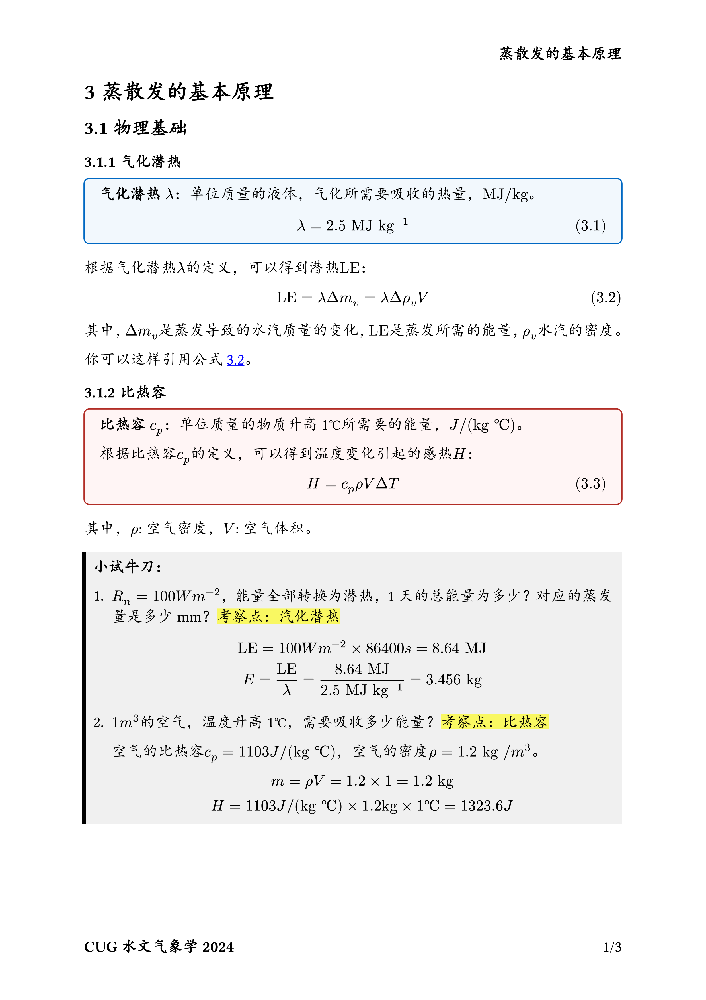
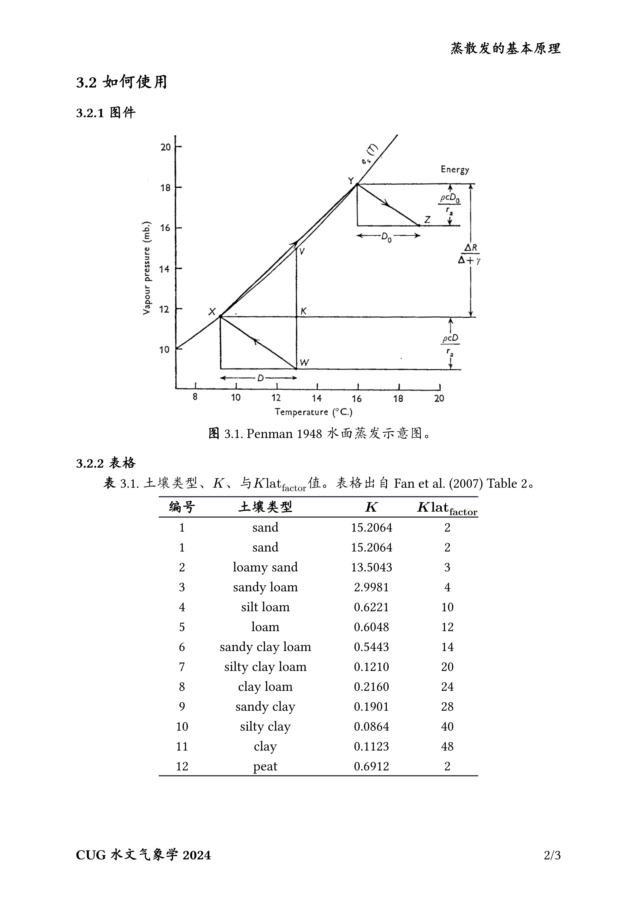

# typst自然科学报告写作规范

案例：[ch03_Evapotranspiration.typ](ch03_Evapotranspiration.typ)


## Installation

```bash
# powershell
mkdir -path $env:APPDATA/typst/packages/local
cd $env:APPDATA/typst/packages/local
git clone https://github.com/CUG-hydro/modern-cug-report.typ modern-cug-report
```

**VSCode tinymist**
<!-- <https://github.com/hongjr03/tinymist-nightly-installer> -->

> 安装最新版 VScode tinymist
<!-- ```bash
iwr https://github.com/hongjr03/tinymist-nightly-installer/releases/latest/download/run.ps1 -UseBasicParsing | iex
``` -->

## Usage

```typst
#import "@local/modern-cug-report:0.1.1": *
// #import "@preview/modern-cug-report:0.1.1": *
#counter(heading).update(2)
#let delta(x) = $Delta #x$

#show: (doc) => template(doc, 
  footer: "CUG水文气象学2024",
  header: "蒸散发的基本原理")

#show heading.where(level: 1): set text(weight: "regular")

= 蒸散发的基本原理

== 物理基础
```

## CUG-Report 样例

<!--  -->





